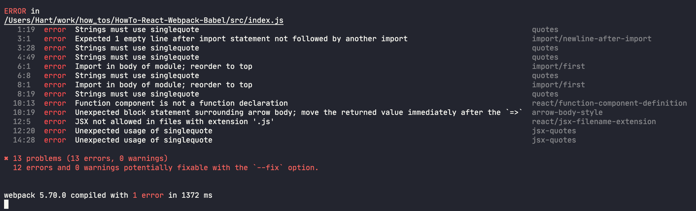

# Eslint Configuration

## Eslint Dependencies
[eslint package](https://www.npmjs.com/package/eslint).
Now there are several optional packages you can install as dependencies depending on how you want to setup the linter. We will be leveraging the built in initilizer for this.

```bash
npm install --save-dev eslint
```

## Eslint Initilizer
Once this has been installed we can through the setup process using the built in initilizer.

```bash
npm create @eslint/config
```
### Step through prompts

Config has multiple steps.  Adjust for your need.

## Enforce Eslint Rules
Setup linter with WebPack.

### Additional Dependencies

- [eslint-webpack-plugin](https://www.npmjs.com/package/eslint-webpack-plugin) to connect webpack and eslint together.
- [@babel/eslint-parser](https://www.npmjs.com/package/@babel/eslint-parser) to add the ability to look at our existing eslint config.

```bash
npm install --save-dev eslint-webpack-plugin @babel/eslint-parser
```

### Add to webpack the new plugin.

In webpack.config.js:
```js
const ESLintPlugin = require('eslint-webpack-plugin');

module.exports = {
  // ...
  plugins: [new ESLintPlugin()],
}
```

### Set eslint parser

In .eslintrc.js:
```js
module.exports = {
  env: {
    browser: true,
    es2021: true,
  },
  extends: [
    'plugin:react/recommended',
    'airbnb',
  ],
  // Here is our new parser option set to Babel
  parser: "@babel/eslint-parser",
  parserOptions: {
    ecmaFeatures: {
      jsx: true,
    },
    ecmaVersion: 'latest',
    sourceType: 'module',
  },
  plugins: [
    'react',
  ],
  rules: {
  },
};
```

Example:

